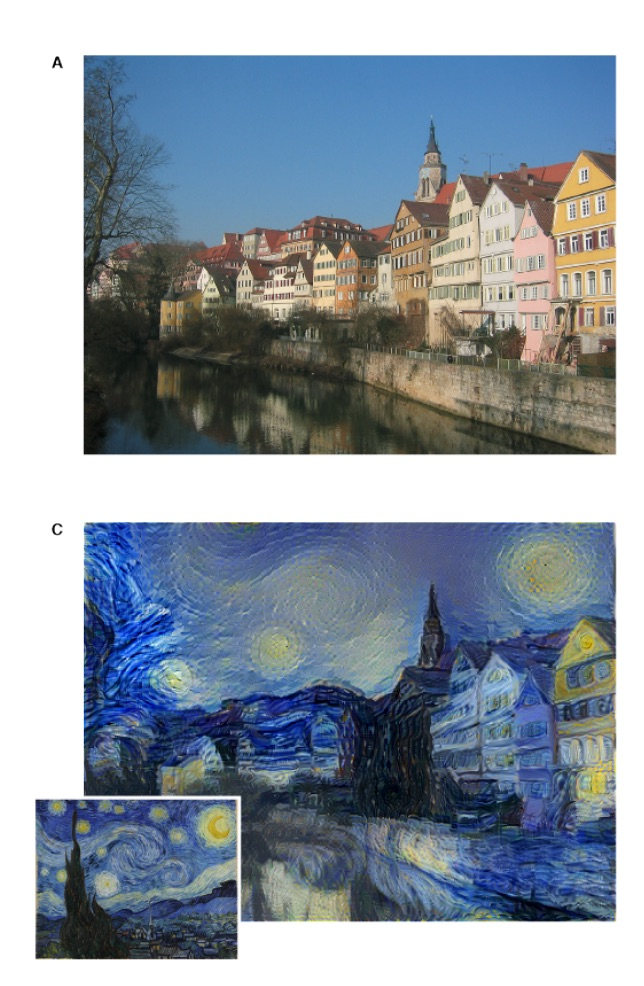

# [A Neural Algorithm of Artistic Style (Gatys 2015)](https://arxiv.org/abs/1508.06576)
Gatys et al. present a way to repurpose a deep network trained for image 
classification to redraw images in the style of some reference image. 
For example, this method can be used to render arbitrary photographs in the
style of Van Gogh's _The Starry Night_.

Here's a popular open-source implementation of the paper that includes some
visual examples: <https://github.com/jcjohnson/neural-style>.

The problem is defined by two images: a _content_ image and a _style_ image.
The goal is to generate a _blended_ image that resembles the _content_ image
drawn in the fashion of the _style_ image. Here's an example from the paper:

In the above picture, the photograph of the waterfront is the content image,
_The Starry Night_ is the style image, and the starry-night waterfront is the
blended image.

### The Algorithm 
Let $$C$$ denote the content image, $$S$$ the style image, and $$B$$ the blended
image, and let $$f(C, l)$$ be the representation of $$C$$ in the $$l$$-th
layer of the network (similarly for $$S$$ and $$B$$). The blended image is
found by approximately solving the below optimization problem.

$$
\begin{equation*}
\begin{array}{ll}
\mbox{minimize} & \alpha \|f(C,\ell) - f(B, \ell)\|^2_F +
    \beta \sum_{l=0}^{L} w_l \|f(S,l)^Tf(S,l) - f(B,l)^T f(B,l)\|^2_F
\end{array}
\end{equation*}
$$

where $$\ell$$ is fixed, $$w_l$$ is a weight that incorporates the the size
of layer (see the paper for details), and $$B$$ is the optimization variable.
Gram matrices are used above to capture correlations between the features
within each layer. The $$\alpha$$-weighted expression measures the similarity
to the content image, while the $$\beta$$-weighted term measures the similarity
to the style image.

In the paper's notation, $$P_l$$ corresponds to $$f(C,l)$$, $$A_l$$
corresponds to (the gram matrix) of $$f(S,l)$$, and $$F_l$$ corresponds
to $$f(B,l)$$.
