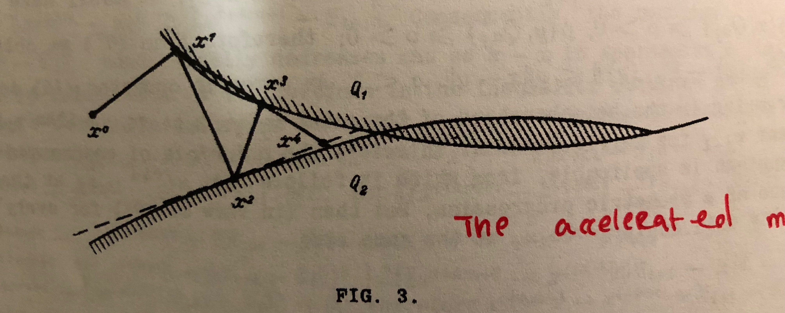

# [The Method of Projections for Finding the Common Point of Convex Sets (Gubin 1966)](https://www.sciencedirect.com/science/article/pii/0041555367901139)

## 1. Overview

----------------------------------------------------------------------

*Section Breakdown*  
I.   Methods of successive projection \[4.5 pp\]  
II.  Proofs of \[convergence results\] theorems 1 and 2 \[8.5 pp\]  
III. Rate of convergence \[3.5 pp\]  
IV.  Examples and Applications \[7.5 pp\]

----------------------------------------------------------------------

This paper reviews *methods of successive projections* for finding a point in
the intersection of an arbitrary number of convex sets; this problem is known
as the *convex feasibility problem*. The family of methods under consideration
traces back to the alternating projections method of the 1930s, due to Johnn
von Neumann[^1].  Though von Neumann cast it as a routine for finding a point
in the intersection of two subspaces, his method was later generalized to the
convex feasibility problem.

Convex cone programs that admit strong duality can be [reduced to instances of
the convex feasibility
problem](https://www.akshayagrawal.com/papers/pdf/odonoghue2016scs.pdf) via the
KKT system or the self-dual homogeneous embedding thereof.

## 2. Key Contributions
**(A)** Strong convergence results for the method of projections,
proving that under certain conditions the sequences in question converge
linearly (presented in section II of the paper).

**(B)** A cheap way to accelerate projection methods (presented in section
III of the paper).

Simple examples show that projection methods are often painfully slow to
converge, so convergence results are not that interesting. But, because, as we
shall see, such methods are so simple, accelerating them with minor alterations
is an attractive prospect.

## 3. The Method of Projections

#### 3.1 Definition: Projection
A projection of the point $$x$$ onto a set $$R$$ of a normed space $$H$$ is a
point $$\Pi_R(x)$$ that minimizes the distance between $$x$$ and $$R$$, in the
following sense:

$$
\|x - \Pi_R(x)\| = \inf_{y \in R} \|x - y\|.
$$

#### 3.2 The Convex Feasibility Problem & the Method of Projections
Let the sets $$Q_{\alpha_{i}}$$ convex, for $$i = 1 \ldots n$$. The *convex
feasibility problem* is the problem of finding a common point $$x \in
\cap_{i} Q_{\alpha_{i}}$$.

The method of projections constructs a sequence of points $$\{x_i\}$$ where
$$x_0$$ is arbitrary and $$x_{k+1}$$ is chosen from $$x_{k}$$ by selecting a
set $$Q_{\alpha(k)}$$ and stepping in the direction of projecting $$x_k$$ onto
the selected set, i.e.,  

$$
x_{k+1} = x_k + \lambda_k(\Pi_{\alpha(k)}(x_k) - x_k), \quad 0 \leq \lambda_k \leq 2.
$$

Different policies for selecting the index $$\alpha(k)$$ yield different
instantiations of the method of projections. A simple, classical policy is
the **cyclic one** that sets as $$\alpha(k) := \alpha_{(k \mod n) + 1}$$.

Cyclic projections is an extension of von Neumman's **alternating
projections** method: alternating projections is cyclic projections when the
number of sets $$n=2$$. Perhaps surprisingly, the case of $$n > 2$$ is not any
more general than $$n=2$$: any convex feasibility problem that involves greater
than 2 sets can be reduced to a higher-dimensional problem with exactly two
sets: one set is the cartesian product of all the sets from the original
problem, and the other set is an affine set that enforces block-wise equality
of the vector.

### 4. Proof Ingredients
A proof of convergence for the alternating projections method can be found in
in [2][^2], and a more general proof can be found in the reviewed paper.
Rather than replicate Gubin's proofs in full, I'll present their main
ingredients, i.e., the key lemmas about projections onto convex sets that are
composed to construct them. In the following, let $$R$$ be a closed convex set
and denote the projection of $$x$$ onto $$R$$ by $$\Pi x$$.

*Existence and uniqueness.* The projection $$\Pi x$$ exists and is unique.

*Supporting hyperplane.* The vector $$x - \Pi x$$ supports $$R$$ at $$\Pi x$$, i.e.,

$$
(x - \Pi x)^T(y - \Pi x) \leq 0, \quad \forall y \in R.
$$

*Proof.* By convexity of $$R$$, convex combinations of $$y$$ and $$\Pi x$$
are also in $$R$$: $$\lambda y + (1 - \lambda)\Pi x \in R $$ for
$$\lambda \in [0, 1]$$. Because the projection of $$x$$ is point in $$R$$ 
closest to $$x$$,

$$
\begin{align*}
\|x - \Pi(x)\|^2 &\leq \|x - (\lambda y + (1 - \lambda) \Pi x) \|^2 \\
&= \|x - \Pi x\|^2 + \lambda^2\|\Pi x - y\|^2 + 2\lambda(x - \Pi x)^T(\Pi x - y),
\end{align*}
$$

so in particular $$(x - \Pi x)^T(y - \Pi x) \leq \lambda \| \Pi x - y\|^2$$.
Taking $$\lambda \rightarrow 0$$ proves the result.

*Non-expansivity.* The projection operator is non-expansive, which means that

$$
\| \Pi x - \Pi y \| \leq \| x - y \|,
$$

for arbitrary $$x$$ and $$y$$. A proof for this claim that uses the supporting
hyperplane property can be found in a
[note on alternating
projections](https://akshayka.github.io/optimization/2016/10/14/alternating-projections/)
that I've published online.

### 5. An Acceleration Scheme for Alternating Projections

Alternating projections is simple; unfortunately, it can also be terribly slow.
A pathological example where the two convex sets are halfspaces that are almost
parallel, as illustrated below.

Gubin proposed in this paper a small extension to alternating projections that
he hoped would accelerate its convergence. The high-level idea is to surf
supporting hyperplanes that are generated in the process of projecting onto
the convex sets $$Q_1$$ and $$Q_2$$, as illustrated below.

The iterates are chosen in the following fashion:

$$
\begin{align*}
x_1 &= \Pi_1 x_0 \\
x_2 &= \Pi_2 x_1 \\
x_3 &= \Pi_1 x_2 \\
x_4 &= x_1 + \lambda (x_3 - x_1),
\end{align*}
$$

where $$\lambda$$ is chosen such that $$x_4$$ falls on the intersection of
the line spanning $$x_1$$ and $$x_3$$ with a hyperplane supporting $$Q_2$$ at
$$x_2$$. In particular,

$$
\lambda = \frac{\|x_1 - x_2\|^2}{(x_1 - x_3)^T(x_1 - x_2)}.
$$

Subsequent iterates are attained in the same fashion.

Gubin proves the convergence of this accelerated method, though he does not
analyze the rate at which the method converges. But one can see empirically
that his acceleration provides significant speed-ups in at least simple
examples: e.g., in the pathological "almost parallel" halfspace
intersection problem, $$x_4$$ is already a solution. 

[^1]:
    John Von Neumann. The Geometry of Orthogonal Spaces. _Functional Operators
    (AM-22), Vol. II._ Princeton University Press, 1950. Reprint of lecture
    notes originally compiled in 1933.

[^2]:
    Boyd, S., & Dattorro, J. (2003). Alternating projections. _EE392o, Stanford
    University._
